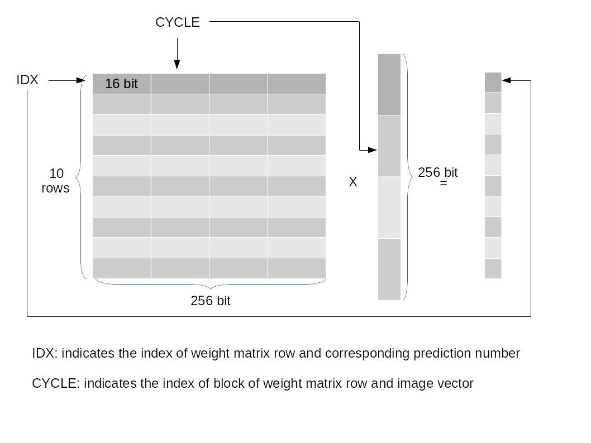

# How the classifier works

## The whole network is one binary layer

The input is a 16×16 image flattened to **256 bits**. There are 10 output
classes (digits 0–9), so the learned weights form a **10 × 256 grid of bits**.

To classify, for each class you compare the 256 image bits against that class's
256 weight bits and count how many **agree**. The class with the most agreements
wins. That is the entire model.

Because every value is a single bit (+1 or −1), the two operations are cheap:

- **multiply → XNOR.** Two ±1 values multiply to +1 when they're equal, −1 when
  different. In bits that is exactly XNOR.
- **sum → popcount.** Adding up the ±1 products reduces to counting the 1-bits
  (a *popcount*), because `dot = 2·popcount(XNOR) − 256`, which is monotonic in
  the popcount — so the largest popcount is the largest score.

No multipliers, no floating point. That's why a whole digit classifier fits in
about a third of a 1280-LUT iCE40.

## The five stages

The 256-bit vectors are processed **16 bits at a time over 16 cycles**, for each
of the 10 classes.

| Stage | Name | What it does |
|-------|------|--------------|
| IF | fetch | pick which class and which 16-bit chunk to process next |
| RR | read  | read the weight chunk and image chunk |
| EXE | execute | `XNOR` the two chunks, `popcount`, accumulate into the class score |
| CP | compare | keep the class with the highest score so far (argmax) |
| FI | finish | once all 10 classes are done, latch the winner and raise `done` |

In `fpga/bnn_classifier.v` the `RUN` state implements IF/RR/EXE, the
`running > best` comparison is CP, and the `FIN` state is FI.

## The one trick: the image is pre-transposed

In the original hardware the image lived across 16 LUTs and the design gathered
one bit per LUT per cycle. Here, `tools/gen_bnn_data.py` does that gather **in
Python**, so each stored image chunk already holds the 16 bits the EXE stage
needs. The Verilog then indexes both weight and image by cycle — much simpler,
identical result.

## Expected result

9 of the 10 stored test images classify correctly; **image 4 is read as 9**.
This matches the original project exactly and is the signature the software
model (`tools/golden_reference.py`) and the Verilog testbench both check against.
